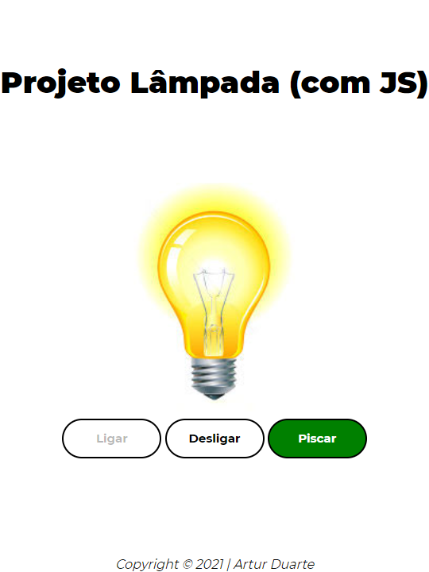

# Projeto Lâmpada

Projeto criado com objetivo didático para as aulas de PWFE do curso Desenvolvimento de Sistemas do [SENAI Jandira](https://jandira.sp.senai.br/), sobre orientação do professor [Fernando Leonid](https://github.com/fernandoleonid)

O projeto consiste em criar uma lâmpada que tenha três ações:

* Ligar 
* Desligar
* Quebrar

Todo o código foi construido seguindo as boa praticas, como responsabilidade única e funções puras. 
  

<!-- Imagem do Layout Atualizada -->

    

